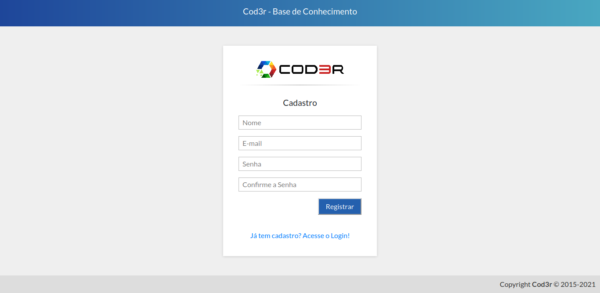
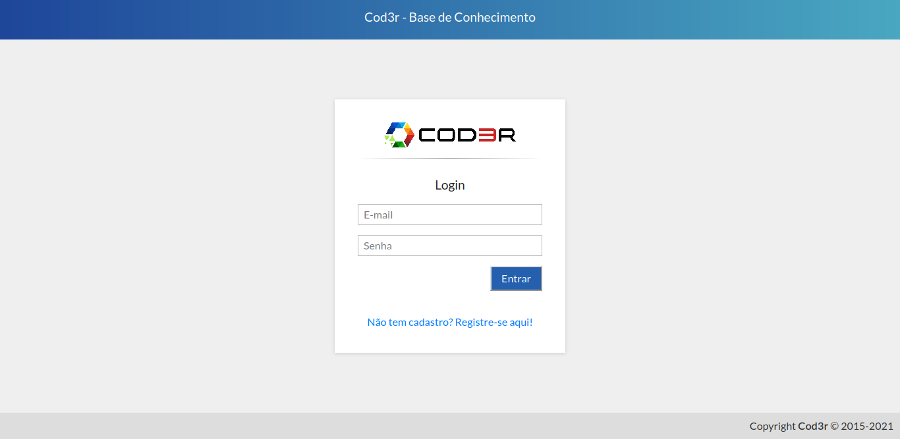
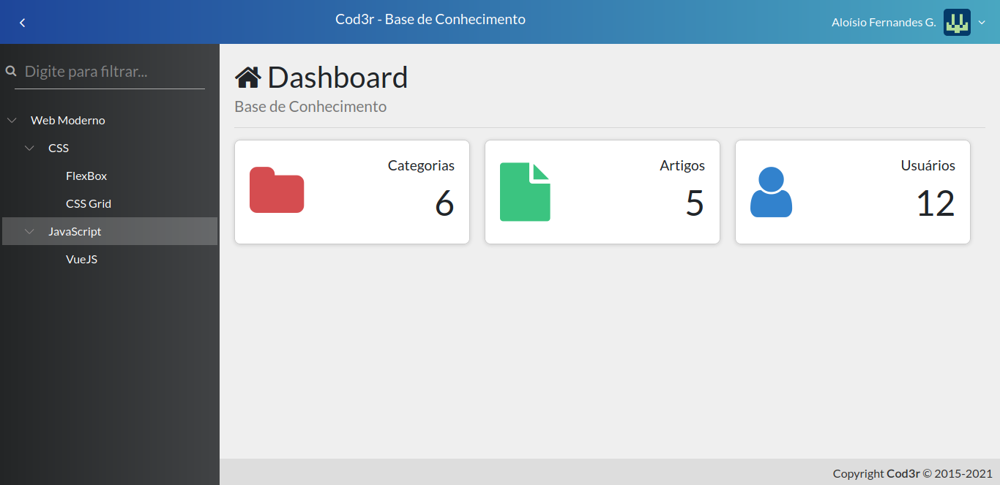
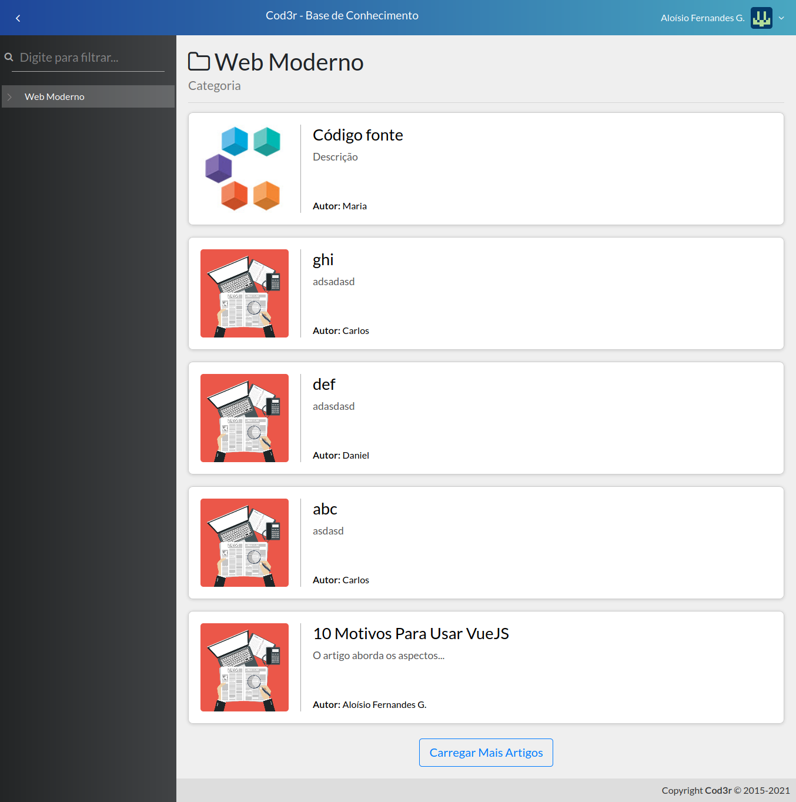
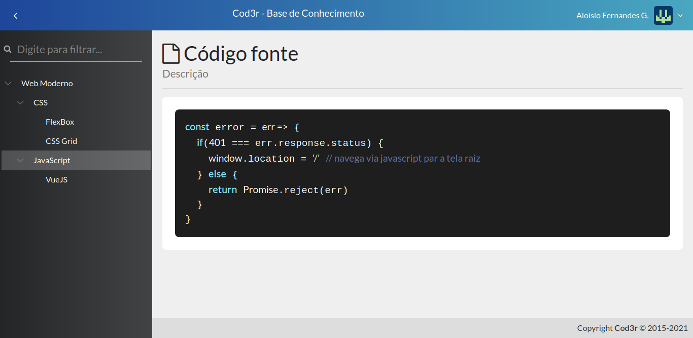

# Base de Conhecimento
 Projeto final do curso de Javascript web moderno da Cod3r feito com VueJS. Nesta aplicação, os usuários podem relizar cadastro por email, nome e senha e visualizar artigos separados por categorias. 
 Apenas administradores podem cadastrar, alterar ou remover artigos e categorias, sendo que uma categoria não pode ser removida se tiver artigos associados. Apenas um administrador pode conceder acesso a administração para outro usuário. Artigos e categorias são paginados em grupos de 10 itens. 
 Essa aplicação faz uso de um banco de dados relacional postgreSQL para operações (cadastrar, alterar, listar e deletar) relacionadas aos usuários, artigos e categorias. As informações relcaionadas a estatísticas como quantidade de artigos, categorias e usuários são armazenadas em banco de dados não relacional mongoDB.

# Aplicação

  

  

  

  

  

  

  

  

# Funcionalidades
 - Login e Signin de usuários por email e senha.
 - Cadastro de artigos, categorias e usuários (apenas admin).
 - Autenticação de usuário admin por token.
 - Autenticação de jwt.

# Principais Tecnologias
 - Node.js
 - Express
 - Axios
 - Knex
 - VueJS
 - PostgreSQL
 - MongoDB
 - JWT